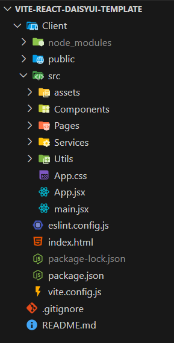

# Vite React DaisyUI Template

A **starter template** for quickly building React applications using [Vite](https://vitejs.dev/), [Tailwind CSS](https://tailwindcss.com/), and [DaisyUI](https://daisyui.com/).  
This template comes with **Tailwind CSS and DaisyUI pre-configured** and includes a **well-structured folder organization** to help you start coding faster and keep your project maintainable.

---

## Features
- ⚡ **Vite** – Lightning-fast development environment and build tool.
- ⚛ **React** – Modern UI library for building component-based applications.
- 🎨 **Tailwind CSS** – Utility-first CSS framework.
- 🌼 **DaisyUI** – Tailwind CSS components library for beautiful UI.
- 📂 **Predefined folder structure** – For better scalability and organization.

---

## Folder Structure



You can delete the image after cloning the template, and also delete `Tempo.txt` files inside the folders.  
They are maintained just to let the folders be pushed inside the repo.

## How to Use the Template

### 1. Using `degit` (Recommended)
```bash
npm install -g degit
```
```bash
npx degit github_username/github_repo_name new-project_folder_name
```
```bash
cd new-project
npm install
```
```bash
npm run dev
```
### 2. Cloning with Git
```bash
git clone https://github.com/user/repo.git new-project](https://github.com/Zineeddine-Abd/Vite-React-daisyUI-Template.git
```
```bash
cd new-project
npm install
```
```bash
npm run dev
```
### 3. Using Github
you will find a button called **Use this template** at the **top-right corner of your repository**. You can click on it to create a new project repository from this template.

## Why Use This Template?
- Saves time by avoiding repetitive setup steps.
- Clean and scalable project structure.
- Pre-integrated DaisyUI for ready-to-use UI components.
- Perfect starting point for building modern React applications.

